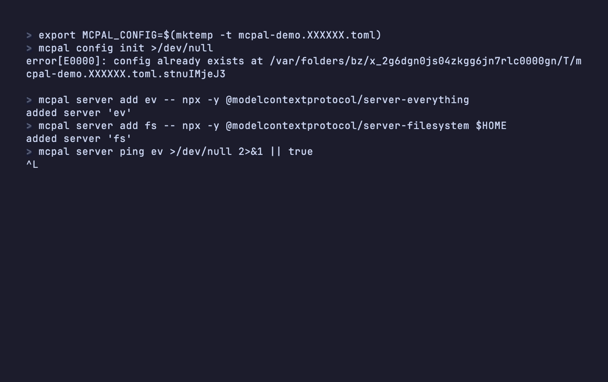
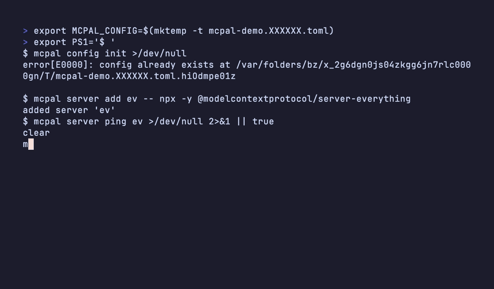

<h1 align="center">mcpal</h1>

<p align="center">
  <b>Inspect, call, and script any MCP server — over stdio or HTTP, with OAuth, from one CLI.</b><br/>
  <sub>The curl-equivalent for the Model Context Protocol.</sub>
</p>

<p align="center">
  <a href="https://github.com/pawelb0/mcpal/actions/workflows/ci.yml"></a>
  <a href="https://github.com/pawelb0/mcpal/releases/latest"></a>
  <a href="https://github.com/pawelb0/mcpal/blob/main/LICENSE"></a>
  <a href="https://pawelb0.github.io/mcpal/"></a>
</p>

<p align="center">
  <a href="#quickstart">Quickstart</a> •
  <a href="#install">Install</a> •
  <a href="#examples">Examples</a> •
  <a href="https://pawelb0.github.io/mcpal/">Docs</a>
</p>

<p align="center"></p>

> Your editors (Claude Desktop, Cursor, Zed, opencode) configure dozens
> of MCP servers — GitHub, Linear, Notion, a filesystem sandbox. Once
> configured, the only way to drive them is from inside that chat app.
> mcpal is the shell tool that was missing: point it at any server and
> call tools, read resources, get prompts, run raw JSON-RPC, or stream
> notifications.

## Why

- **Debug servers you're building.** `tool call`, `tool describe`,
  `raw`, `watch` against the server you just started — no chat-UI
  round-trip.
- **Script integrations in CI.** A nightly job that pulls Linear
  tickets or files a GitHub issue, through the same servers your
  editors use.
- **Call already-configured servers.** Cursor set up `linear`? Run
  `mcpal tool list cursor:linear`. No copy-pasting `mcp.json`.

## Quickstart

### Call a server your editor already configured

```bash
mcpal server discover                       # what's installed where
mcpal tool list cursor:linear --names-only
mcpal tool call cursor:linear get-issue --id ENG-123
```

### Add your own

```bash
# stdio
mcpal server add ev -- npx -y @modelcontextprotocol/server-everything
mcpal tool call ev echo --message hi

# HTTP + OAuth 2.1 (PKCE + DCR)
mcpal server add notion --http https://mcp.notion.com/v1
mcpal auth login notion --oauth
mcpal tool list notion
```

### Browse interactively

```bash
mcpal tui                                   # split-pane MCP browser
```




> Tapes that produce these GIFs live in [`demo/`](demo/README.md).

## Install

macOS / Linux via Homebrew:

    brew tap pawelb0/tap
    brew install pawelb0/tap/mcpal

Debian / Ubuntu:

    curl -fsSLO https://github.com/pawelb0/mcpal/releases/latest/download/mcpal_amd64.deb
    sudo dpkg -i mcpal_amd64.deb

From source:

    cargo install --git https://github.com/pawelb0/mcpal --path crates/mcpal

Prebuilt binary into `$HOME/.local/bin`:

    curl -fsSL https://raw.githubusercontent.com/pawelb0/mcpal/main/dist/install.sh | sh

## Synopsis

    mcpal <command> [<ref>] [options]

A `<ref>` is one of:

- a name registered with `mcpal server add`
- `<source>:<name>` from `mcpal server discover` (e.g. `cursor:linear`)
- a bare `<name>` if unambiguous across discovered sources
- an `https://` URL
- a path to a JSON `ServerSpec`

`mcpal discover` reads the MCP server lists that other clients
(Claude Desktop, Cursor, opencode, ...) already wrote to disk; those
servers are addressable directly.

## Examples

Inspect a server:

    mcpal server ping ev
    mcpal server capabilities ev
    mcpal tool describe ev echo

Call a tool (flags, JSON, or stdin):

    mcpal tool call ev echo --message hi
    mcpal tool call ev echo --params '{"message":"hi"}'
    echo '{"message":"hi"}' | mcpal tool call ev echo --params -

HTTP with a bearer token:

    mcpal server add github --http https://api.githubcopilot.com/mcp/
    mcpal auth login github --bearer ghp_xxx
    mcpal tool list github

Resources, prompts, notifications:

    mcpal resource read ev demo://resource/static/document/architecture.md
    mcpal prompt get ev args-prompt --city Dallas --state Texas
    mcpal watch ev                          # one YAML doc per event

Pipelines and diagnostics:

    mcpal --output json tool list ev | jq -r '.[].name'
    mcpal --query '[].name' tool list ev
    mcpal debug doctor

Full command reference, recipes, and the protocol compliance matrix
live in the [manual](https://pawelb0.github.io/mcpal/).

## Configuration

`~/.config/mcpal/config.toml` on Linux,
`~/Library/Application Support/mcpal/config.toml` on macOS,
`%APPDATA%\mcpal\config.toml` on Windows. Override with
`MCPAL_CONFIG=/path/to/file`.

```toml
[server.everything]
transport = "stdio"
command = "npx"
args = ["-y", "@modelcontextprotocol/server-everything"]

[server.notion]
transport = "http"
url = "https://mcp.notion.com/v1"
auth = { type = "bearer_env", env = "NOTION_MCP_TOKEN" }
```

Secrets do not live in this file. `mcpal auth login` writes them to
the OS keyring.

## License

MIT
